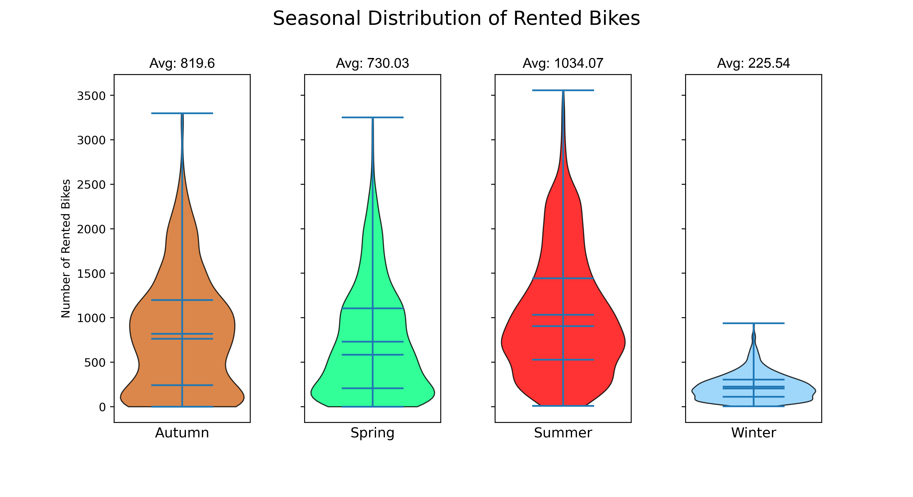
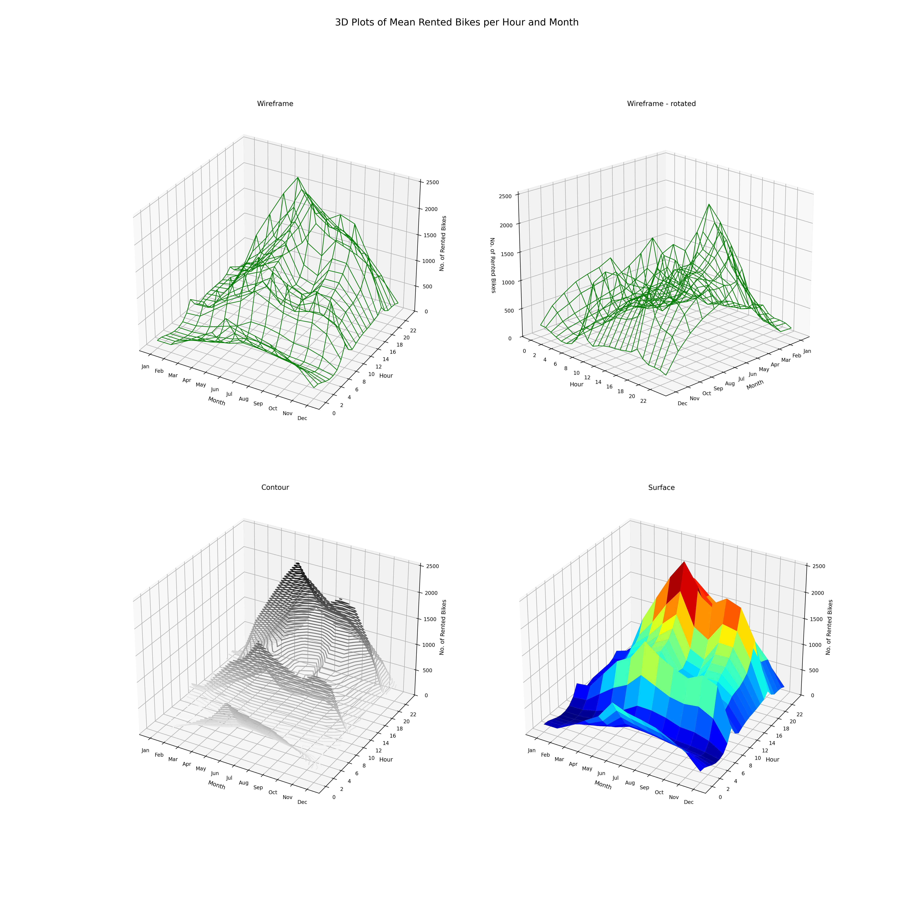

# Data Visualization with Matplotlib and Seaborn Walkthrough
Hands-on series: master 2D/3D Matplotlib and Seaborn to turn data into decisions. Visualize bike-rental demand for ABC Bikes and uncover income drivers from survey data. 12 milestone notebooks teach styling, annotations, and statistical relationships—fast, clear, publication-ready.     

---

## 📘 liveProject
The liveProject is available here:  
👉 [Data Visualization with Matplotlib and Seaborn](https://www.manning.com/liveprojectseries/data-visualization-ser) 

---

## 📘 Walkthrough
The full step-by-step walkthrough accompanying this repository is available here:  
👉 [Data Visualization with Matplotlib and Seaborn](https://www.oreilly.com/videos/data-visualization-with/10000MNLW202502/)  

---

## 📂 Repository Structure

| Directory/File         | Description                                                                                     |
|------------------------|-------------------------------------------------------------------------------------------------|
| **`notebooks/`**       | Contains Jupyter notebooks for each project and milestone (e.g., `P1_M1.ipynb`, `P2_M3.ipynb`). |
| **Project 1**          | 2D Plotting with Matplotlib: Line/scatter plots, grouped bars, subplots, and annotations.      |
| **Project 2**          | 3D Plotting with Matplotlib: `mplot3d` visualizations, projections, and multi-variable plots. |
| **Project 3**          | Plotting with Seaborn: Categorical, numerical, and pairwise relationship visualizations.        |

Each folder corresponds to a project milestone, matching the structure of the liveProject:

Data_Visualization_with_Matplotlin_and_Seaborn/
│── notebooks/
│   ├── P1/
│       ├── data/
│       ├── img/
│   ├── Walkthrough_P1_M1.ipynb
│   ├── Walkthrough_P1_M2.ipynb
│   ├── Walkthrough_P1_M3.ipynb
│   └── Walkthrough_P1_M4.ipynb
│   ├── P2/
│       ├── data/
│       ├── img/
│   ├── Walkthrough_P2_M1.ipynb
│   ├── Walkthrough_P2_M2.ipynb
│   ├── Walkthrough_P2_M3.ipynb
│   └── Walkthrough_P2_M4.ipynb
│   ├── P3/
│       ├── data/
│       ├── img/
│   ├── Walkthrough_P3_M1.ipynb
│   ├── Walkthrough_P3_M2.ipynb
│   ├── Walkthrough_P3_M3.ipynb
│   └── Walkthrough_P3_M4.ipynb
├── LICENSE
└── README.md

## About the series

This repo hosts a 3-project, 12-milestone walkthrough that turns real datasets into actionable visuals with Matplotlib (2D & 3D) and Seaborn. You’ll play the data analyst for **ABC Bikes** (rental demand across time, weather, and season) and **Global Consensus Bureau** (income drivers like education, hours, gender, age).&#x20;

## Projects & milestones

* **Project 1 — 2D Plotting with Matplotlib (4 milestones).** Build line/scatter, grouped bars, multi-subplot layouts, and seasonal distributions; annotate insights and export publication-quality figures. Examples include hourly rental trends and a four-season violin-plot comparison.

* **Project 2 — 3D Plotting with Matplotlib (4 milestones).** Use `mplot3d` to visualize multiple variables at once (e.g., temperature × hour × rentals), adjust rcParams, label points, and control projections.

* **Project 3 — Plotting with Seaborn (4 milestones).** Clean census survey data and explore categorical, numerical, and pairwise relationships with Seaborn (bar/cat, joint/kde, pair plots), including theming and palettes for clear storytelling. 

Each milestone includes a **solution notebook** and produces concrete deliverables (PDF/PNG/HTML) to showcase results.

## What you’ll practice

* Matplotlib figure anatomy (Figure/Axes), subplots/GridSpec, annotations, legends, color maps, and high-DPI export.
* 3D scatter/surfaces with `mplot3d`, axis control, labeling, and rcParams tuning.&#x20;
* Seaborn theming, palettes, categorical/relational/regression grids, joint/kde/rug, and pairwise exploration.

## Prerequisites

You’ll be comfortable with intermediate Python/Pandas and Jupyter; basic familiarity with Matplotlib is helpful. Seaborn milestones assume you can set themes/palettes and tweak plot rcParams.

## Navigate the repo

* Milestones: open the solution notebook in `notebooks/P{project}_M{milestone}.ipynbn`.
* Deliverables: each milestone specifies format and naming (e.g., PDFs at 300 dpi, or HTML exports).

*Tip:* If you’re skimming, begin with Project 1 Milestone 2 (hourly rentals) to see quick wins, then jump to the Seaborn numerical milestone for joint/kde insights.
